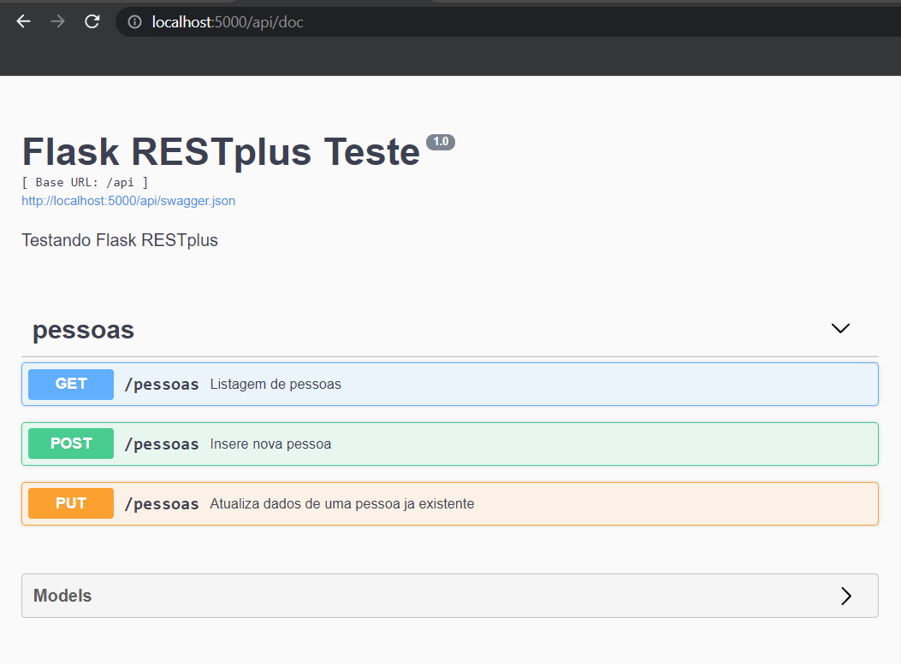

#### Teste documentação API com flask_restplus
 

<h5>Executar</h5>
* Windows
* > set FLASK_APP=flaskr
* > set FLASK_ENV=development
* > set FLASK_RUN_HOST=0.0.0.0
* > set FLASK_RUN_PORT=5000
* > flask run

* Linux
* > export FLASK_APP=flaskr
* > export FLASK_ENV=development
* > export FLASK_RUN_HOST=0.0.0.0
* > export FLASK_RUN_PORT=5000
* > flask run
 

<h5>Dependencias</h5>
* dotenv
* flask-restplus
* Werkzeug
* mysql-connector-python
 

<h5>Documentação Swagger</h5>
* http://localhost:5000/api/doc

 

<h5>Postman Collection</h5>
<a src="doc/flask-restplus-teste.postman_collection.json">Collection</a>
 