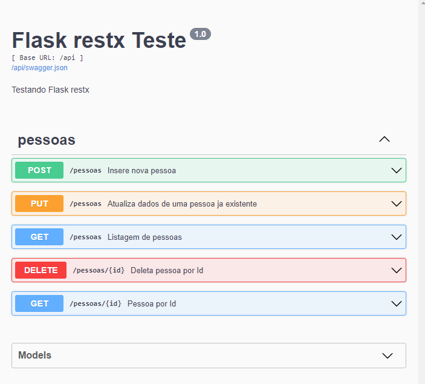

<h1>Teste documentação API com flask_restplus</h1>
 

<h5>Executar - Windows</h5>
<ul>
    <li>set FLASK_APP=flaskr</li>
    <li>set FLASK_ENV=development</li>
    <li>set FLASK_RUN_HOST=0.0.0.0</li>
    <li>set FLASK_RUN_PORT=5000</li>
    <li>flask run</li>
</ul>

<h5>Executar - Linux</h5>
<ul>
    <li>export FLASK_APP=flaskr</li>
    <li>export FLASK_ENV=development</li>
    <li>export FLASK_RUN_HOST=0.0.0.0</li>
    <li>export FLASK_RUN_PORT=5000</li>
    <li>flask run</li>
</ul>
 

<h5>Dependencias</h5>
<ul>
    <li>dotenv</li>
    <li>flask-restplus</li>
    <li>Werkzeug</li>
    <li>mysql-connector-python</li>
</ul>
 

<h5>Documentação Swagger</h5>
<ul>
    <li>Link:
        <a href="http://localhost:5000/api/doc">http://localhost:5000/api/doc</a>
    </li>
    <li>
        
    </li>
</ul>
 

<h5>Postman Collection</h5>
Link: <a href="doc/flask-restplus-teste.postman_collection.json">Collection</a>
 